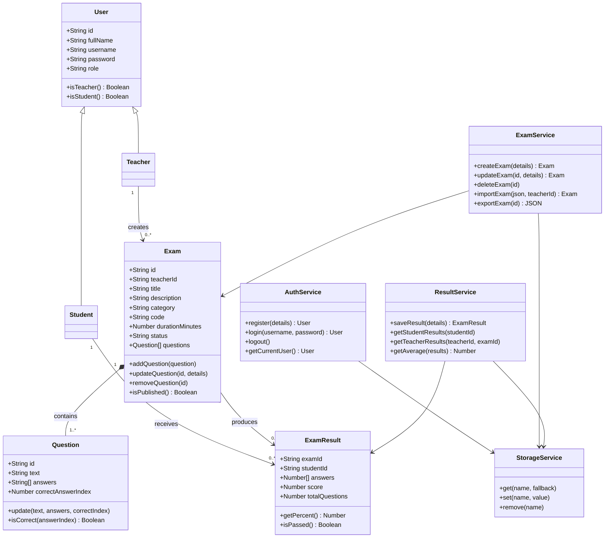

# OOP Diagram

## חלוקת אחריות

| שכבה | אחריות |
|---|---|
| Models | מצב והתנהגות של ישויות המערכת |
| Services | אימות משתמשים, התמדה ופעולות עסקיות |
| UI | תצוגה, הודעות, formatting ו־escaping |
| app.js | ניתוב וחיבור בין אירועי UI לשירותים |
